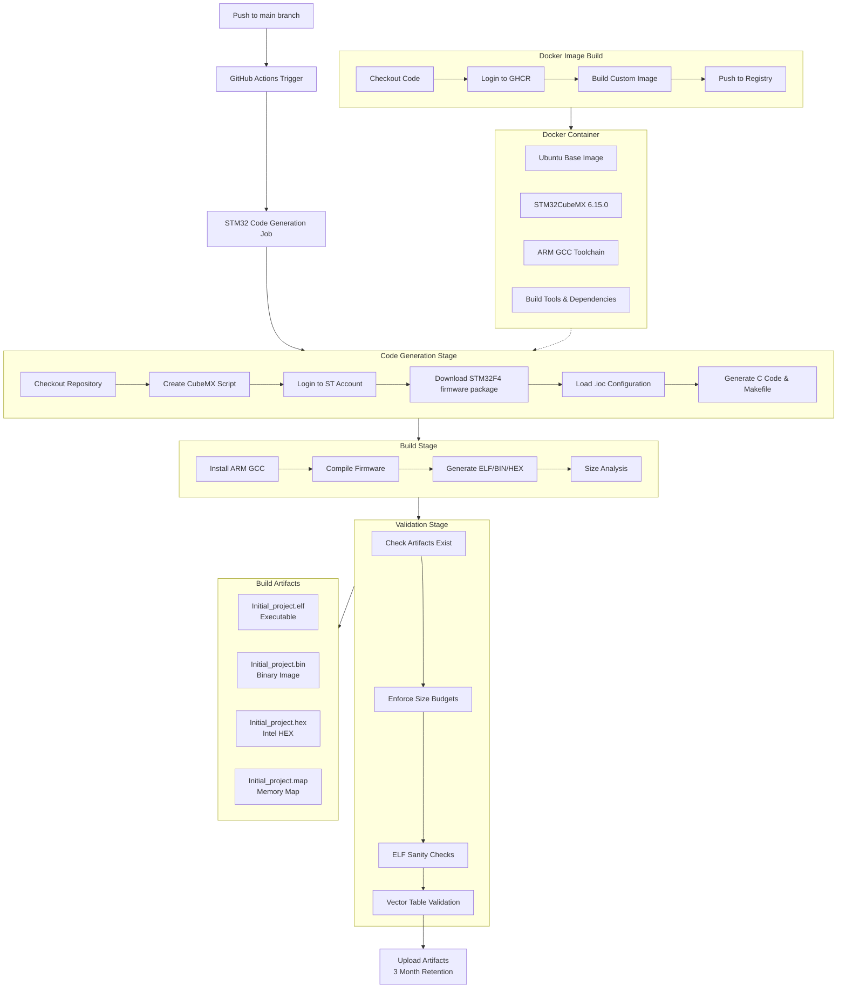

# STM32-AWS CI/CD Workflows

This directory contains GitHub Actions workflows for automated STM32 firmware development.

## Workflow Overview

## Design Philosophy: .ioc as Source Code

### Current Approach (Recommended)
- **`.ioc` file** = Source of truth for hardware configuration
- **Generated C files** = Build artifacts (not committed to git)
- **CubeMX regeneration** = Part of build process

### Alternative Approach (Not Recommended)
You could commit the generated code and only regenerate when `.ioc` changes, but this creates:

- **Merge conflicts** when multiple developers modify hardware configurations
- **Sync issues** between `.ioc` and committed C code
- **Repository bloat** from large generated HAL files
- **Inconsistent states** where code doesn't match configuration
- **Manual maintenance** of generated files

The current approach treats `.ioc` as source code and C files as build artifacts - which is the recommended STM32 workflow. This ensures:
- Hardware configuration changes are atomic
- Generated code is always consistent with `.ioc`
- Clean separation between design (`.ioc`) and implementation
- Reproducible builds across environments

## Workflows

### 1. `build-image.yml`
Builds Docker container with STM32CubeMX and toolchain.

**Triggers**: Manual dispatch
**Output**: `ghcr.io/torchikaii/stm32-aws/cubemx-runner:latest`

### 2. `stm32_generate_code.yml`
Main CI/CD pipeline for firmware generation and build.

**Triggers**: Push to main, PR to main, manual dispatch
**Container**: Custom Docker image with STM32CubeMX
**Outputs**: Firmware binaries (.elf, .bin, .hex, .map)

## Caching & Performance

First builds are slow due to:
- Docker layer downloads
- STM32Cube firmware package download (~hundreds of MB)
- Initial compilation of HAL libraries

Subsequent builds are faster through:
- Docker layer caching
- Incremental compilation
- GitHub Actions runner caching

## Security

- ST account credentials stored as GitHub secrets
- Container registry authentication via GitHub tokens
- No hardcoded paths or credentials in workflows