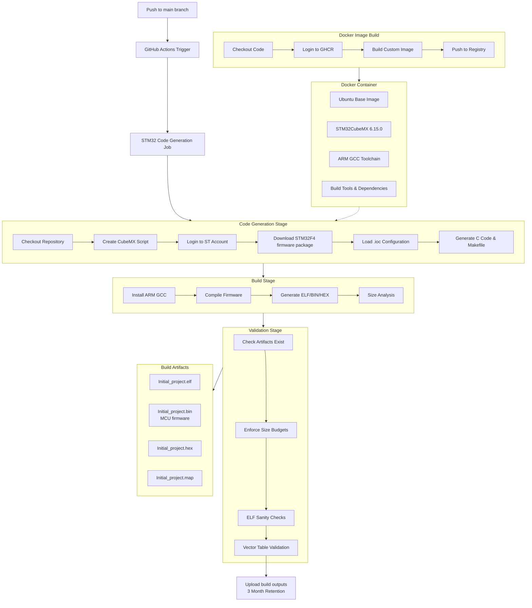

### STM32-AWS CI/CD Workflows

This directory contains GitHub Actions workflows for automated STM32 firmware development.

### Workflow Overview

flowchart below describes CI/CD proccess for both `build-image.yml` and `stm32_generate_code.yml` workflows 

### Workflow explanation

###### 1. `build-image.yml`
Builds Docker container with STM32CubeMX and toolchain.

- **Triggers**: Manual dispatch
- **Output**: `ghcr.io/torchikaii/stm32-aws/cubemx-runner:latest`

###### 2. `stm32_generate_code.yml`
Main CI/CD pipeline for firmware generation and build.

- **Triggers**: Push to main, PR to main, manual dispatch
- **Container**: Custom Docker image with STM32CubeMX
- **Outputs**: Firmware binaries (.elf, .bin, .hex, .map)

In theory CI/CD should work without the .ioc file, it would just grab the existing C code, however you should think of it like:

- `.ioc` = architectural blueprint
- Generated C files = constructed building
- STM32Cube package = construction materials/tools

## Caching & Performance

First builds are slow due to:
- Docker layer downloads
- STM32Cube firmware package download (~hundreds of MB)

Subsequent builds are faster through:
- Docker layer caching

## Security

- ST account credentials stored as GitHub secrets
- Container registry authentication via GitHub tokens
- No hardoced credentials in workflows (gitleaks enabled)