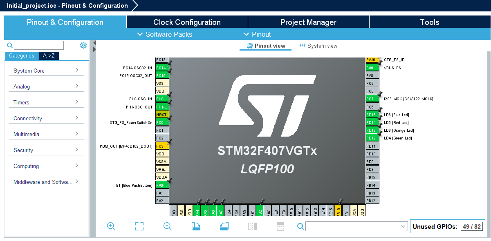

### What is STM32 ?
STM32 (company ST Microelectronics) is a family of microcontrollers aka MCU's
(Micro Controller Unit) based on ARM CPU architecture and used for creating
embedded systems.

---

### What is MCU ?
MCU is essiantially a chip (for example LQFP64 or LQFP100 package (a package is
essiantially a form (case) of a chip LQFP means that pins are placed from all 4 sides
of a chip and 100 or 64 means the amount of pins chip has)) that has CPU, RAM,
flask memory (similar to how PC has HDD), various interfaces like CAN, Ethernet,
and other peripherals like ADC, DAC, PWM, osclilators, etc... So you get the point,
everything mentioned above is stored in a single chip, that is ready to be soldered
on a PCB.

---

### Hardware properties of STM32 MCU's
STM32 platform mainly uses ARM cortext 32 bit CPUs like Cortex M1, M0, etc..
STM32 platform like other embedded system platforms comes with variety of Hardware
peripherals such as:

#### The basics:

- GPIO (General purpose input/output) pins. Those pins essiantially can be assigned
to mimick any behavior. Or just set voltage to HIGH (logical 1) or LOW (logical 0)
- ADC (Analog Digital Converter) This thing is basically a voltmeter/osciloscope.
It is used for reading voltage on a single pin and then converts it to digital
value. main points
of ADC are:
  * resolution (how many bits does ADC have) - this determines the precision of ADC
  * reference voltage - determines max voltage/precision of ADC
  * Sampling frequency - how fast can ADC do conversions. This limits the frequency
  of signal we want to sample (see Nyquist theory)
ADC can be used to measure temperature (you measure voltage drop on thermoresistor),
light (you measure voltage drop on photoresistor), analog signal reading.
- DAC (Digital analog converter) - This can be used as waveform generator to generate
any shape/frequency/phase analog electrical signals. Parameters are similar to ADC
- Internal timers - allows you to do actions accordingly when time passes. for
example if you want to toggle LED for 1 second you can implement `counter` variable
and check when that variables becomes `counter == 1000 // miliseconds`
- External timers - STM32 MCU allows you to connect external timers as well if you
need better precision of faster clock speeds.
- I2C (aka I squared C) - digital protocol that chips (mostly on the very same PCB)
communicates with each other.
- SPI - similar to IC2, but less stadartized and maybe less robust.
- UART - digital protocol that allows MCU to talk with other systems and transmit
data

#### all STM32 MCUs have these pins:

#### Important ! these pins allways have to be connected no matter what.

- VDD - for connecting voltage (typically 3.3V)
- VSS - for connecting ground
- NRST - resets entire chip when pulled low
- BOOT0 - bootloader activation/ bootmode selection/ normal operation
- SWDIO - used to program MCU, send data.
- SWCLK - used to program MCU, used in combination with SWDIO for signal
synchronization.

#### more advanced features

- DMA (direct memory acces) allows you to read or write memory without using CPU,
thus saving power.
- ETHERNET - OSI layer 2 communication protocol.
- Wifi - wireless OSI layer 2 communication protocol.
- CAN (Controller Area Network) - very robust electronics control protocol used in
cars and aircraft.
- NVIC - CPU interrrupts handling.
- WatchDog timer - timer that still runs in super deep sleep mode and can be used
to wake MCU.

---
### STM32 MCU families

**fig. 1** STM32 families

Although many STM32 MCU share same hardware, some of them are optimised for
performance, while other for power saving. There is also very new to the market
STM32 N-series for AI workloads optimisation (runs AI workflows 10x, 100x times
faster then reuglar sieries). Note that not all MCUs have same perhipherals, for
example some MCUs may not have CAN, some have less ADC channels then others, etc...

---

### STM32 development environment

STM32 MCUs are mainly programmed using C, although you will see very little
of assembly code in the development process, and you can also choose to write full
assembly.

Development environment consist of two main tools:
- GUI pin/interface configuration, called CubeMX
- IDE itself (STM32CubeIDE) used for writing code, debugging and flashing code to
MCU.

It goes like this:
- you open a project and select MCU or dev board.
- using GUI (CubeMX) (see fig. 2) you configure peripherals and by your
configurations it auto generates C code for you.
- after code was generated you add your chuncks of code to the generated code (
yes thats another reason why many devs don't like STM32, because normally you would
include modules that you need instead of having system code and user code in
the very same file) you can take a look at this project's `Core/Src/main.c`:
```C

/* Infinite loop */
/* USER CODE BEGIN WHILE */
while (1)
{
  /* USER CODE END WHILE */
  MX_USB_HOST_Process();

  /* USER CODE BEGIN 3 */
  // Blink blue LED (LD6) with 1 second interval
  HAL_GPIO_TogglePin(LD6_GPIO_Port, LD6_Pin); // Toggle blue LED
  HAL_Delay(1000); // 1 second delay
  /* USER CODE END 3 */
}
/* USER CODE END 3 */
}
```


**fig. 2** CubeMX GUI environment

---

### Hardware abstraction


The very big problem with STM32 series is that you have to write your own code from
ground up. Let's say you want to connect a digital temperature sensor via I2C (super
common case); you can't just write `#include library_name` at the top of the file and
start using the `read_temperature()` functions. You have to read the datasheet and
manually create your own drivers. If you're lucky enough, you may find drivers that
match your device, but even the installation process can be quite hard:
- Connect your temperature sensor to MCU proper pins and remember them.
- You copy all your `drivers.c` files to the `Core/Src/` directory.
- Copy all `drivers.h` files to the `Core/Inc/` directory.
- Find what hardware pins in drivers code and replace them with pins that you
have connected in reality.
- find your system files like `stm32f4xx_hal_conf.h` in the driver files and replace
with the actual header files of your MCU (for you it could be like
`stm32l4xx_hal_conf.h` or `stm32l0xx_hal.h`).
- Initialise the pins to proper values (youre lucky if driver files has good comments,
because I had to figure it out for hours) in the GUI and generate code.
- include the `drivers.h` file at the top of the `main.c`
- start calling commands that are defined in `drives.h` in your `main.c` file.

The questions you will start asking during this settup will be:
- What is the name of my system file ? Is it `stm32f4xx_hal_conf.h` ?
- How should this pin be initialised, do I need to use pull up or pull down ?
- What clock speeds should I use ?
- How my other hardware will interfere with this (not all peripherals can be used
at the same time)
- Where is documentation for these drivers (in many cases there's no)

you see as every MCU is different ant there are thousands of variaties, like every
single MCU has different `/Core/Src/` and `Core/Inc/` structures and files are
named different names...

The STM32 has indeed done some simplification: HAL (Hardware abstraction layer)
functions. This means that no matter what MCU you're using this command will allways
yield same result:

```C
HAL_GPIO_WritePin(LD6_GPIO_Port, LD6_Pin, GPIO_PIN_SET);

```
this code will always set the `LD6_Pin` to HIGH no matter the MCU youre using,
but the problem is, what is `LD6_Pin` ? `LD6_Pin` Can be anything you define in the
GUI interface and for different MCUs `LD6_Pin = GPIO_PIN_5`, but for others it is
different. The hardware still persist in the code:
 ```C
HAL_GPIO_WritePin(GPIOF, GPIO_PIN_5, GPIO_PIN_RESET);

 ```
but in this case not all MCU have GPIOF, some only has GPIOA, GPIOB but not GPIOF,
so you get the point that abstraction of hardware should be done for every single
possible STM32 MCU if you want to get some results going.

---

### What is RTOS ?

RTOS (Real Time Operating System) is such OS that runs on embedded systems (for
example MCUs) such that:
- RTOS has tasks, while bare metal uses super loop.
- The most important aspect of RTOS is that it provides predictable response times,
which is crucial for applications where timing is critical, such as embedded systems
in automotive, aerospace, and medical devices.
- it supports multitasking, actually it's not multitasking because it quickly
switches from one task to another (it's called multiplexing) and gives a feeling
that all tasks are being done at the same time. Task is just a function in code.
If your CPU has more than 1 core, then you can do real multitasking and do 2 RTOS
tasks at once without multiplexing
- Tasks can communicate with each other using semaphores and queues.

while same RTOS can be installed on different variety of devices (STM32, Microchip,
Atmel AVR, NXP LPC) and all of those devices would use same RTOS commands (like
`sudo` in Linux), the contents of each RTOS task will have to be still written in
code that MCU supports (for STM32 it will be HAL functions).

some popular RTOS systems:
- FreeRTOS
- VxWorks
- ThreadX
- Zephyr
- Linux on constrained devices

---

### RTOS/STM32 debugging
 Initially when building STM32 project you don't just buy a single chip, but entire
 dev board that may include:
 - MCU chip itself
 - ST-Link chip that helps to connect MCU to PC
 - some LEDs for debugging
 - some buttons
 - USB ports, AUDIO DAC's (if any)
 - bradboard ready pins

After you test your system on a breadboard, then you can start creating PCB with
components you used and after having successful PCB you can start creating mass
production devices.

ST-Link chip is very nice tool, that can be bought separately (you're not gonna
place ST-Link on every single production PCB as it's only used while debugging/
development and not when system works well) it's sometimes also called "programmer".
ST-Link chip can also be reflashed with SEGGER J-Link firmware which allows you
to for example set up SEGGER SystemView app that can monitor all CPU instructions
that it has ran, instruction by instruction, and if you're using FreeRTOS it can
also show different RTOS tasks in different colors. However SEGGER middleware is
super hard to install as you need to copy so much .c and .h files to your STM32
project.
